<h1>Block Game</h1>
Block Game is a browser game inspired by one of my favourite childhood games, Breakout. The aim of the game is to use a paddle to bounce a ball and bounce it off the walls to remove all of the blocks. Breaking all the blocks will result in the level being completed.
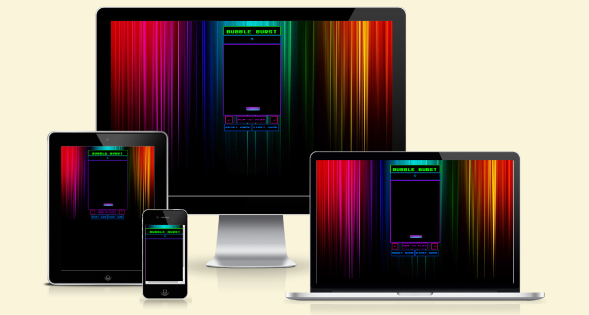
<h2>Live Link</h2>
A live link to this project can be found <a href="https://dani-brennan.github.io/project-2/">here.</a>
<h2>User Experience</h2>
<h3>Project Goals</h3>
<ul>
    <li>The website is fun, interactive and easy to navigate.</li>
    <li>Game instructions are clear, easy to follow and accessible to the player at all times.</li>
    <li>Game is playable on both computer and touch devices</li>
</ul>
<h3>User Stories</h3>
<ul>
<li>As a player, I want the game to be easy to understand</li>
<li>As a player, I want the game to be fun to play</li>
<li>As a player, I want to have access to instructions that teach me how to play the game</li>
<li>As a player, I want to play on computer or on my phone</li>
<li>As a player, I want game controls to be easy to use and access</li>
</ul>
<h3>Typography</h3>
The font I used for this project is <a href="https://fonts.google.com/specimen/Press+Start+2P" target="_blank">Press Start 2P</a> sourced from Google Fonts.

<h3>Wireframes - Balsamiq</h3>

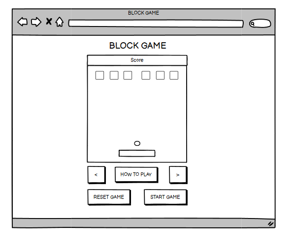

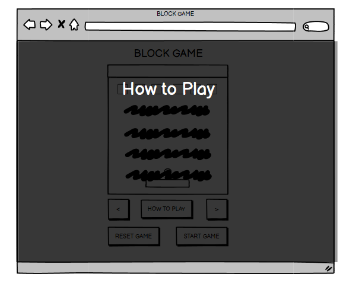

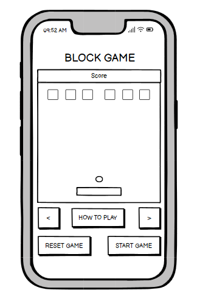

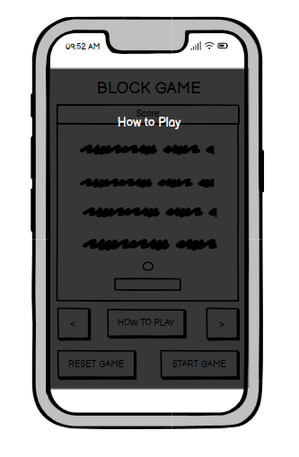

<h2>Technologies Used</h2>

HTML, CSS, JavaScript

<h3>Features</h3>
<h4>Top Bar</h4>

The top bar will have the game title, the score total as well as the notification of when the game is over or if
the player has won.

<h5>Game Title</h5>
This area contains the title of the game.
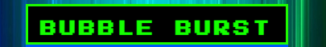
<h5>Score Total</h5>

The user will earn points for every block broken. The updated score will show here.

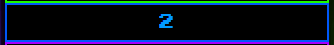
<h5>Game Win/Loss</h5>
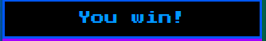
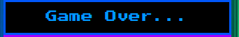

<h4>Game Area</h4>

This area will have the game. The player can interact with the paddle and bounce the ball towards the
blocks and off the walls. The top of the game area will have the blocks, the bottom of the game area will have
the paddle (which can only move along the x axis). The ball will spawn above the paddle but can move
throughout the game area. If the ball collides with a block it will disappear. Once all the blocks have been
broken the level is completed. If the ball reaches the bottom of the game area, it will result in game over.

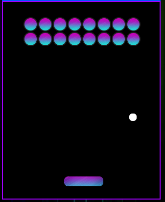
<h5>Paddle</h5>

<h5>Ball</h5>

<h5>Blocks</h5>
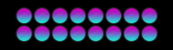

<h2>Testing</h2>
<h3>Validating</h3>

Html was validated using <a href="https://validator.w3.org/" rel="noopener" target="_blank">W3 Validator</a>

CSS was validated using <a href="https://jigsaw.w3.org/css-validator/" rel="noopener" target="_blank">W3 Jigsaw</a>

JavaScript was validated using <a href="https://jshint.com/" rel="noopener" target="_blank">JS Hint</a>

Lighthouse testing

<h3>Manual Testing</h3>
<table>
<thead>
  <tr>
    <th>Browser</th>
    <th>Outcome</th>
    <th>Pass/Fail</th>
  </tr>
</thead>
<tbody>
  <tr>
    <td>Chrome</td>
    <td>No changes to appearance or functionality</td>
    <td>Pass</td>
  </tr>
  <tr>
    <td>Safari</td>
    <td>No changes to appearance or functionality</td>
    <td>Pass</td>
  </tr>
  <tr>
    <td>Firefox</td>
    <td>No changes to appearance or functionality</td>
    <td>Pass</td>
  </tr>
</tbody>
</table>
<h3>Device Compatibility</h3>
<table>
<thead>
  <tr>
    <th>Browser</th>
    <th>Outcome</th>
    <th>Pass/Fail</th>
  </tr>
</thead>
<tbody>
  <tr>
    <td>Desktop</td>
    <td>No changes to appearance or functionality</td>
    <td>Pass</td>
  </tr>
  <tr>
    <td>Tablet</td>
    <td>No changes to appearance or functionality</td>
    <td>Pass</td>
  </tr>
  <tr>
    <td>Mobile</td>
    <td>No changes to appearance or functionality</td>
    <td>Pass</td>
  </tr>
</tbody>
</table>
<h4>Elements Testing</h4>
<table>
<thead>
  <tr>
    <th>Element</th>
    <th>Outcome</th>
    <th>Pass/Fail</th>
  </tr>
</thead>
<tbody>
  <tr>
    <td>Game Area</td>
    <td>Functions as expected</td>
    <td>Pass</td>
  </tr>
  <tr>
    <td>Paddle</td>
    <td>Paddle moves left and right and stays inside the game area as expected. Paddle collides with the ball as expected.</td>
    <td>Pass</td>
  </tr>
  <tr>
    <td>Start Game Button</td>
    <td>Functions as expected.</td>
    <td>Pass</td>
  </tr>
   <tr>
    <td>Reset Game Button</td>
    <td>Functions as expected.</td>
    <td>Pass</td>
  </tr>
   <tr>
    <td>How to Play Button</td>
    <td>Functions as expected.</td>
    <td>Pass</td>
  </tr>
   <tr>
    <td>Game controls (Desktop)</td>
    <td>Left and right keyboard keys move the paddle left and right as expected. Left and right buttons move the paddle left and right as expected.</td>
    <td>Pass</td>
  </tr>
  <tr>
    <td>Game Controls (Touch screen)</td>
    <td>Left and right buttons move the paddle left and right as expected.</td>
    <td>Pass</td>
  </tr>
  <tr>
    <td>Ball</td>
    <td>Moves as expected. Collision with walls and paddle is as expected.</td>
    <td>Pass</td>
  </tr>
  <tr>
    <td>Game Loss</td>
    <td>Game over works as expected: when the ball hits the bottom of the game area.</td>
    <td>Pass</td>
  </tr>
  <tr>
    <td>Game Win</td>
    <td>Game win works as expected: when all blocks are destroyed.</td>
    <td>Pass</td>
  </tr>
  <tr>
    <td>Score</td>
    <td>Score works as expected: increases in amount as blocks are destroyed.</td>
    <td>Pass</td>
  </tr>
</tbody>
</table>

<h3>Bugs</h3>
<ul>
<li>I encountered a bug where the ball would go through the paddle occasionally. I discovered that I had accidentally put blockWidth instead of paddleWidth, which meant that physically the block looked correct, but it was the size of the block, which has a smaller width, which resulted in the ball passing through.</li>
<li>When centering the div containing the game, it resulted in the game area being offset i.e., The game
looked like it was in the right place, but the game collision barriers were still floating to the left.
Changing the game area position to absolute fixed this issue.</li> 
<li>When implementing mobile touch controls I had a similar problem moving the paddle. The paddle would not move physically, but an invisible paddle still allowed me to bounce the ball. I solved this bug by moving mobile touch control functions, drawPaddle and movePaddle to outside of
the main loop.</li>
</ul>
<h2>Future Implementations</h2>
<ul>
<li>More levels with increasing difficulty</li>
<li>Different types of blocks</li>
<li>Powerups</li>
<li>Music/Sound effects</li>
</ul>
<h2>Deployment</h2>

I developed this project using GitPod which I then commited and pushed to GitHub.

Follow the steps below to deploy the website to GitHub Pages from its GitHub repository.

<ul>
<li>Log in to GitHub and locate the GitHub repository.</li>
<li>Locate the settings button in the menu located at the top of the repository.</li>
<li>Scroll down the settings page until you find the Pages section.</li>
<li>Select Master Branch from the dropdown menu located under Source.</li>
<li>A link for the website will be generated.</li>
</ul>
<h2>Credits</h2>
<h3>Code</h3>

To learn how to create the basic block breaker game elements, I learned from <a href="https://www.youtube.com/watch?v=3KWEud12Pxo">this tutorial.</a>This tutorial helped me to gain a better understanding of how to create the game area, paddle movements, ball movements and collision.

<h4>Copyright</h4>

Copyright (c) 2020 Ania Kubow
Permission is hereby granted, free of charge, to any person obtaining a copy of this software and associated documentation files (the "Software"), to deal in the Software without restriction, including without limitation the rights to use, copy, modify, merge, publish, distribute, sublicense, and/or sell copies of the Software, and to permit persons to whom the Software is furnished to do so, subject to the following conditions:

<h3>Images</h3>
<a href="https://pixabay.com/illustrations/spectrum-psychedelic-green-gradient-553216/" rel="noopener" target="_blank">Background image</a>
<a href="https://pixabay.com/illustrations/background-pink-blue-gradient-1591229/" rel="noopener" target="_blank">Block image</a>
<h3>Wireframes</h3>
The wireframes were created using <a href="https://balsamiq.com/" rel="noopener" target="_blank">Balsamiq.</a>
<h3>Icons</h3>
Made by <a href= "https://fontawesome.com/" rel="noopener" target="_blank">Fontawesome</a>